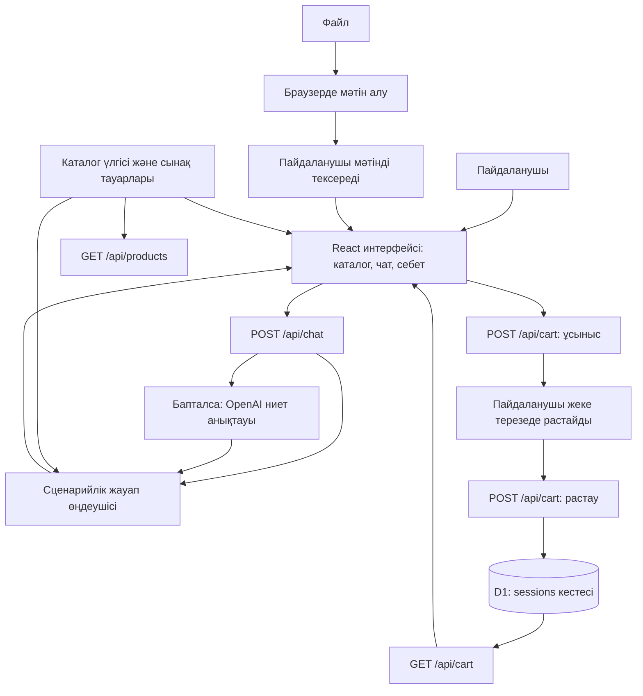

# 1. Жоба атауы

**EKT · ЖИ-көмекші — ekt.kz каталогы бойынша кеңесші**

HACKALEM AI кейсіне арналған веб-прототип: электр тауарларын іздеу, сипаттамаларын қарау, қоймадағы қалдықты тексеру, балама таңдау және пайдаланушы растағаннан кейін демонстрациялық себетке қосу.

> **Ағымдағы күйі:** 40 тауардан тұратын каталог үлгісі және 2 синтетикалық сынақ тауары бар. Демо API кілтінсіз жұмыс істейді. OpenAI адаптері кодта дайындалған, бірақ оны қосуға серверлік баптаулар қажет. Нақты ekt.kz себеті, төлем және тапсырыс рәсімдеу қосылмаған.

## 2. Қысқаша сипаттама

Электр тауарын таңдаған сатып алушыға сипаттаманы, қоймадағы санын, баламасын және сатып алу шарттарын бір жерден білу қажет. Жоба осы сұрақтарға сайттағы бірыңғай чат арқылы жауап беруге арналған.

Негізгі пайдаланушылар — электротехникалық өнім сатып алатын жеке тұлғалар және компания өкілдері. Көмекші каталогтан табылған мәліметті көрсетеді, дерек жетіспегенде немесе сипаттамаларда қайшылық болғанда оны ашық хабарлайды. Мақсаты — бастапқы кеңес алуды жеңілдету; сатылым өсімі немесе менеджер жүктемесінің азаюы осы репозиторийде өлшенбеген.

## 3. Не іске асырылды

| Мүмкіндік | Ағымдағы іске асырылуы |
| --- | --- |
| Каталог және іздеу | 40 тауар; артикул, ID, атаудағы жеткізуші нөмірі және сөздер бойынша іздеу; санат сүзгісі мен беттерге бөлу. |
| Тауар карточкасы | Атауы, бағасы, суреті, ekt.kz-тегі бастапқы бетіне сілтеме және қолда бар сипаттамалары. |
| Қоймадағы қалдық | `027228` / ID `515291` тауарына жеті қоймадағы қалдық берілген. Қалған 39 тауардың қалдығы белгісіз деп көрсетіліп, себетке қосылуы шектелген. |
| Үш тіл | Интерфейс пен сценарийлік жауаптар қазақша, орысша және ағылшынша. Әдепкі тіл — қазақша; тіл таңдауы браузерде сақталады. |
| Чат-көмекші | Тауар, сипаттама, қалдық, сертификат, балама, төлем және жеткізу туралы сценарийлер; тауар таңдалғаннан кейін санын хабарламада көрсету мүмкіндігі. |
| Балама ұсыну | DEMO-A үшін DEMO-B ұсынылады және айырмашылығы түсіндіріледі. DRX тауарларына атауындағы белгілер бойынша тексеруді қажет ететін кандидаттар табылады. |
| Демо-себет | Қойма мен санды тексеру → ұсыныс дайындау → жеке терезеде растау → себетті жаңарту. Себет беті — `/#cart`. |
| Қате әрекеттерді шектеу | Қалдықтан артық, теріс, бөлшек немесе нөлдік сан қабылданбайды. Қайталанған растау санды екі рет қоспайды; қатар келген өзгерістер тексеріледі. |
| Файлдан мәтін алу | XLS/XLSX, DOCX, мәтін қабаты бар PDF, JPEG/PNG, TXT және CSV. Мәтін браузерде алынып, жіберер алдында пайдаланушыға көрсетіледі. |
| Деректердегі қайшылық | `027228` атауындағы 160 А мен бастапқы қасиетіндегі 250 А сәйкессіздігі жауапта және растау терезесінде көрсетіледі. |
| Менеджермен байланыс | Байланыс терезесінде телефон мен ekt.kz сілтемесі бар. Хат алмасу менеджерге автоматты түрде жіберілмейді. |
| Қосымша браузер құралы | `document.modelContext` қолдауы бар ортада `search_ekt_catalog` іздеу құралы тіркеледі; ол себетті өзгертпейді. |

## 4. Шешім қалай жұмыс істейді

1. Пайдаланушы сайтқа кіріп, тілді және қаланы таңдайды. Көмекші басты бетте ашық тұрады.
2. «Алматыда 027228 бар ма?» деп жазады немесе файл тіркеп, алынған мәтінді тексеріп жібереді.
3. `/api/chat` сұранысты өңдейді. Негізгі жауап каталог пен ережелерден жасалады. OpenAI бапталған болса, адаптер сұраныстың ниетін және іздеу тіркесін анықтауға қатыса алады.
4. Чат бағаны, қолда бар қалдық пен сипаттамаларды көрсетеді; белгісіз деректі және қайшылықтарды бөлек хабарлайды.
5. Пайдаланушы тауарды таңдап, мысалы, «2 дана қос» деп жазады. Сервер санды, қойманы және себеттегі бұрынғы санды тексеріп, 5 минутқа жарамды ұсыныс жасайды. Осы кезде себет өзгермейді.
6. Пайдаланушы жеке терезеде тауарды, қойманы, санын және сомасын тексеріп, **«Иә, қосу»** батырмасын басады.
7. Сервер ұсынысты, бағаны және қалдықты қайта тексеріп, демо-себетті сақтайды. **«Себетке өту»** сілтемесі оның ағымдағы күйін ашады.

Себет өзгерісі тек серверлік растау жолы арқылы орындалады. ЖИ моделі себетті өзгерту немесе пайдаланушының орнына растау құралын алмайды.

## 5. Технологиялар

| Қабат | Қолданылған технологиялар және міндеті |
| --- | --- |
| Тілдер | TypeScript, JavaScript, CSS, SQL; каталог пен баптаулар үшін JSON. |
| Интерфейс | React 19, Next.js API-лерімен жұмыс істейтін `app/` құрылымы; Radix UI диалогтары, таңдағыштары және басқа компоненттер; Lucide белгішелері. |
| Стильдер | Tailwind CSS 4, `tw-animate-css`, жергілікті shadcn стильдері және `app/globals.css`. |
| Іске қосу және жинақтау | Vinext `1.0.0-beta.5`, Vite 8, Cloudflare Vite плагині. `npm run dev` және `npm run build` осы құралдарды іске қосады. |
| Сервер және сақтау | Cloudflare Workers орындалу ортасы; `DB` атауымен байланыстырылған D1/SQLite. Сессия мен себет операциялары SQL арқылы орындалады. |
| Дерекқор схемасы | Drizzle ORM және Drizzle Kit; схема `db/schema.ts`, бастапқы миграция `drizzle/0000_spicy_slayback.sql`. |
| Файлдарды оқу | SheetJS (`xlsx`) — кестелер; Mammoth — DOCX; PDF.js — PDF мәтіні; Tesseract.js — суреттен орысша/ағылшынша мәтін тану. |
| Қосымша ЖИ интеграциясы | OpenAI Responses API, JSON Schema форматындағы Structured Outputs және нәтижені тексеруге Zod. |
| Тексеру | TypeScript тип тексеруі; Node.js `assert` және `fetch` қолданатын екі API тест жиынтығы. |

Нақты тәуелділіктер мен бекітілген нұсқалар [package.json](package.json) және [package-lock.json](package-lock.json) файлдарында берілген.

**ЖИ моделінің рөлі.** Репозиторийде нақты модель атауы бекітілмеген: оны `OPENAI_MODEL` серверлік айнымалысы анықтайды. [lib/llm.ts](lib/llm.ts) моделі сұраныстың ниетін және қысқа іздеу тіркесін ғана қайтарады. Баға, қалдық және жауап мазмұны каталог пен сценарийлерден алынады. Кілт не модель көрсетілмесе, API қатесі немесе таймаут болса, ережелерге негізделген өңдеу сақталады. Бұл адаптер толық еркін диалог генераторы ретінде іске асырылмаған.

## 6. Жоба архитектурасы



Браузердегі каталог жергілікті деректер модулін пайдаланады; сол деректер жеке `/api/products` интерфейсі арқылы да қолжетімді.

```text
app/
  page.tsx                   # Каталог, чат, файл тіркеу, растау және себет
  globals.css                # Бет стилі және экран өлшеміне бейімделу
  api/products/route.ts       # Іздеу, беттер және бір тауардың деректері
  api/chat/route.ts           # Сұраныс, тіл және қосымша ЖИ өңдеуі
  api/cart/route.ts           # Себет, ұсыныс, растау, бас тарту, тазарту
lib/
  catalog.ts                 # Каталогты толықтыру, іздеу және баламалар
  advisor-v2.ts              # Үш тілдегі белсенді жауап сценарийлері
  llm.ts                     # Қосымша OpenAI адаптері
  cart-rules.ts              # Сан, қалдық, баға және ұсыныс ережелері
  session.ts                 # Cookie, D1 сессиясы және сұранысты тексеру
  i18n.ts                    # Интерфейс пен жауаптарды тілге бейімдеу
  extract-file.ts            # Браузерде файлдан мәтін алу
data/catalog.json            # 40 тауардың бастапқы үлгісі
db/schema.ts                 # sessions кестесінің схемасы
drizzle/                     # Дерекқор миграциясы
tests/                       # API және үш тілдегі сценарийлер
scripts/                     # Орнату және іске қосу құралдары
.openai/hosting.json          # Хостинг жобасының ID-і және DB байланысы
```

**Себетті сақтау.** D1-дегі `sessions` кестесі себетті, белсенді ұсынысты, соңғы растау ID-ін және өзгеріс нұсқасын сақтайды. Сессия 24 сағатқа, ұсыныс 5 минутқа жарамды. `revision` мәні қатар келген жазуларды бақылауға қолданылады. Cookie-де `HttpOnly`, `SameSite=Strict`, ал HTTPS кезінде `Secure` атрибуты бар. POST сұраныстарының `Origin` мәні тексеріледі. Бұл механизмдер өндірістік қауіпсіздік аудитінің орнын алмастырмайды.

## 7. Орнату және іске қосу

### Қажетті орта

- Node.js **22.13.0 немесе одан жаңа нұсқа** және npm.
- Алғаш рет тәуелділіктерді орнатуға интернет.
- Жобаның толық шығарылған қалтасы: оның ішінде `package.json` және `package-lock.json` болуы керек.
- Базалық демоға OpenAI кілті қажет емес. Дерекқор жергілікті режимде іске қосылады.

### Windows / PowerShell

**1. Жоба қалтасын ашыңыз.** ZIP-ті толық шығарып, ішіндегі `ekt-assistant` қалтасына кіріңіз. File Explorer мекенжай жолағына `powershell` жазып, Enter басыңыз. Немесе нақты орналасу жолымен `cd` орындаңыз.

Қалтаны және құралдарды тексеріңіз:

```powershell
Get-Location
Get-ChildItem package.json, package-lock.json
node --version
npm.cmd --version
```

`npm.cmd` PowerShell-дегі `npm.ps1` орындалу шектеуіне байланысты қатені айналып өтуге мүмкіндік береді. Төмендегі пәрмендерді ретімен орындаңыз; әрқайсысы сәтті аяқталғаннан кейін келесісіне өтіңіз.

**2. Тәуелділіктерді орнатыңыз:**

```powershell
npm.cmd ci
```

**3. Жобаны жинаңыз:**

```powershell
npm.cmd run build
```

**4. Жаңа жергілікті дерекқорға бастапқы кестені жасаңыз:**

```powershell
node --import ./scripts/sites-env.mjs ./node_modules/wrangler/bin/wrangler.js d1 execute DB --local --config dist/server/wrangler.json --persist-to .wrangler/state --file drizzle/0000_spicy_slayback.sql
```

Бұл қадам жаңа жергілікті база үшін **бір рет** орындалады. Бір базаға осы миграцияны қайта қолданбаңыз. `dist/server/wrangler.json` алдыңғы жинақтау қадамында жасалады.

**5. Әзірлеу серверін іске қосыңыз:**

```powershell
npm.cmd run dev -- --port 5174
```

Браузерде [http://localhost:5174](http://localhost:5174) ашыңыз. Егер терминал басқа порт көрсетсе, сол мекенжайды қолданыңыз. Сервер жұмыс істеп тұруы үшін терминалды ашық қалдырыңыз; тоқтату — **Ctrl+C**.

Келесі іске қосуда осы қалтада 5-қадам жеткілікті. Жиналған Worker нұсқасын жергілікті тексеруге `npm.cmd start` қолданылады; оның мекенжайын терминалдан қараңыз.

### macOS / Linux

Жоба қалтасында жоғарыдағыдай ретпен орындаңыз:

```sh
npm ci
npm run build
node --import ./scripts/sites-env.mjs ./node_modules/wrangler/bin/wrangler.js d1 execute DB --local --config dist/server/wrangler.json --persist-to .wrangler/state --file drizzle/0000_spicy_slayback.sql
npm run dev -- --port 5174
```

Бұл пәрмендер репозиторийдің әдепкі `portable` іске қосу режиміне арналған.

### Қосымша: ЖИ адаптерін баптау

Жоба түбірінде `.env` әлі жоқ болса, `.env.example` файлын `.env` атауымен көшіріп, мына серверлік мәндерді толтырыңыз:

```dotenv
OPENAI_API_KEY=your_server_side_key
OPENAI_MODEL=your_model_id
```

Таңдалған модель Responses API және Structured Outputs сұранысын қолдауы керек. Баптағаннан кейін серверді қайта іске қосыңыз. Кілтті браузер кодына, Git-ке немесе таратылатын архивке қоспаңыз. Интерфейстегі режим көрсеткіші жауапта қолданылған өңдеу жолын көрсетеді; кілт қосылғанда да барлық жауап міндетті түрде модель арқылы жасалмайды.

### Жиі кездесетін қателер

| Белгісі | Не істеу керек |
| --- | --- |
| `npm.ps1` орындалуына тыйым салынған | Пәрмендерде `npm.cmd` қолданыңыз. |
| `C:\package.json` табылмады немесе `npm ci` lock-файл сұрайды | `package.json` және `package-lock.json` бар ішкі `ekt-assistant` қалтасына өтіңіз. ZIP-тің сыртқы қалтасында немесе `C:\` түбірінде іске қоспаңыз. |
| `no such table: sessions` | Жаңа жергілікті базаға 4-қадамдағы миграция қолданылғанын тексеріңіз. |
| Порт бос емес немесе басқа сайт ашылды | `--port 5175` сияқты бос портты беріп, терминалда көрсетілген мекенжайды ашыңыз. Тесттегі `TEST_ORIGIN` мәнін де өзгертіңіз. |
| Тауарды қосу қолжетімсіз | Үлгідегі 39 тауардың қалдығы белгісіз. Толық қосу сценарийін DEMO-B арқылы тексеріңіз. |

## 8. Шешімді қалай тексеруге болады

### Қазыларға арналған негізгі сценарий

Демоны жаңа браузер сессиясында немесе бос демо-себетпен бастаңыз.

| Қадам | Әрекет | Күтілетін нәтиже |
| --- | --- | --- |
| 1 | Басты бетте **«Демоны байқап көру»** батырмасын басыңыз. | Көмекші DEMO-A жоқ екенін айтып, DEMO-B ұсынады. Демо Алматы қоймасын таңдайды. |
| 2 | Балама туралы жауапты қараңыз. | 3 полюс, 160 А және 400 В AC сәйкестігі; 18 кА орнына 25 кА айырмасы көрсетіледі. Габарит пен селективтілікті тексеру қажет екені айтылады. |
| 3 | **«2 дана қосуды тексеру»** батырмасын басыңыз. | DEMO-B, Алматы, 2 дана × 62 000 ₸ = **124 000 ₸** ұсынысы ашылады. Себетке әлі ештеңе қосылмайды. |
| 4 | **«Бас тарту»** батырмасын басыңыз. | Себет өзгермейді. |
| 5 | Сол ұсынысты қайта ашып, **«Иә, қосу»** батырмасын басыңыз. | Демо-себетке 2 дана қосылады. **«Себетке өту»** арқылы сол сан мен соманы көресіз. |
| 6 | Бетті жаңартыңыз. | Сол сессияның 24 сағаттық мерзімі ішінде себет сақталады. |
| 7 | Каталогқа оралып, **«Демоны байқап көру»** батырмасын қайта басыңыз да, чатқа `7 дана қос` деп жазыңыз. | Қоймадағы 8 данадан бұрынғы 2 дана есепке алынып, артық мөлшер қабылданбайды. |
| 8 | Себетте **«Демо себетті тазарту»** және **«Иә, тазарту»** батырмаларын басыңыз. | Себет босайды; сценарийді қайталауға болады. |

DEMO-A және DEMO-B — синтетикалық сынақ тауарлары; олар нақты сатылым ұсынысы емес.

### Қосымша тексерулер

- **`Алматыда 027228 бар ма?`** — үлгідегі баға **64 920 ₸**, Алматыда **5 дана**, барлық қоймада **23 дана** және **160 А / 250 А** қайшылығы көрсетіледі.
- **`999999 бар ма?`** — үлгіде тауар табылмағаны хабарланады.
- **`027228 сертификатын көрсет`** — сертификат берілмегені айтылады; құжатқа ойдан шығарылған сілтеме жасалмайды.
- **`Төлем және жеткізу шарттары қандай?`** — кодта сақталған шарттар және ekt.kz дереккөзіне сілтеме көрсетіледі.
- **Тілді ауыстыру** — интерфейс пен бұрынғы көмекші жауаптары ауысады; пайдаланушының өз хабарламасы өзгермейді.
- **TXT файлын тіркеу** — `Алматыда 027228 бар ма?` мәтіні бар файлды таңдаңыз. Мәтін алдымен енгізу өрісіне түседі; оны тексеріп барып жіберіңіз.

### Автоматты тексерулер

Сайт бірінші терминалда жұмыс істеп тұрсын. Жоба қалтасында екінші PowerShell терезесін ашыңыз:

```powershell
$env:TEST_ORIGIN = 'http://localhost:5174'
node node_modules/typescript/bin/tsc --noEmit --incremental false
node tests/api-smoke.mjs
node tests/multilingual-smoke.mjs
```

macOS/Linux жүйесінде орта айнымалысын `export TEST_ORIGIN=http://localhost:5174` арқылы беріп, сол үш `node` пәрменін орындаңыз.

- [tests/api-smoke.mjs](tests/api-smoke.mjs) — **20 тексеру**: растауға дейін себеттің өзгермеуі, міндетті келісім, қайталанған және қатар келген растаулар, сессияларды оқшаулау, қалдық, сыртқы Origin, каталог және чат жауаптары.
- [tests/multilingual-smoke.mjs](tests/multilingual-smoke.mjs) — **33 тексеру**: үш тіл, тауар контексі, санды өңдеу, жарамсыз мөлшерлер, балама, бас тарту және себетті тазартуға келісім.

Екі жиынтық сәтті аяқталса, терминалда `20 API checks passed` және `33 multilingual and demo checks passed` деп басталатын жолдар шығады. Тесттер жеке cookie сессияларын пайдаланады. Бұл тексерулер нақты ekt.kz интеграциясын, ақылы модельдің сапасын немесе OCR дәлдігін бағаламайды.

## 9. Деректер және интеграциялар

| Дерек немесе сервис | Қайда қолданылған | Нақты мәртебесі |
| --- | --- | --- |
| Каталог үлгісі | [data/catalog.json](data/catalog.json) | 40 позицияның ID-і, атауы, артикулы, бағасы, сурет және тауар бетінің URL-і сақталған. Бұл — жергілікті көшірме. |
| Толықтырылған карточка | [lib/catalog.ts](lib/catalog.ts) | ID `515291` үшін қалдық, қоймалар, сипаттамалар, ең аз еселік және қайшылық қолмен қосылған. |
| Сынақ тауарлары | `lib/catalog.ts` ішіндегі `fixtures` | DEMO-A: 0 дана; DEMO-B: Алматыда 8 дана. Қалдықсыз тауар мен балама сценарийін көрсетуге арналған. |
| ekt.kz суреттері мен беттері | Каталог URL-дері және `app/page.tsx` | Браузер суреттерді сыртқы мекенжайдан жүктейді; тауар мен менеджер сілтемелері бастапқы сайтты ашады. |
| Сатып алу шарттары | [lib/advisor-v2.ts](lib/advisor-v2.ts) | Мәтін кодта бекітілген, ішінде 23.09.2026 тексеру күні көрсетілген. Автоматты жаңарту жоқ; бұл README шарттарды сыртқы сайттан қайта тексергенін білдірмейді. |
| ekt.kz каталог API-і | JSON ішіндегі `url_api_detail` | URL-дер бар, бірақ ағымдағы өңдеушілер олардан дерек сұрамайды. Нақты API-ге авторизацияланған қосылу іске асырылмаған. |
| OpenAI | [lib/llm.ts](lib/llm.ts) | `https://api.openai.com/v1/responses` мекенжайына қосымша серверлік сұраныс. Кілт пен модель конфигурацияға тәуелді. |
| Cloudflare D1 | [lib/session.ts](lib/session.ts), `.openai/hosting.json` | Себет пен ұсыныстарды сақтау; жергілікті іске қосуда `.wrangler/state` қолданылады. |
| OCR ресурстары | [lib/extract-file.ts](lib/extract-file.ts) | Tesseract.js `rus+eng` тілдерін жүктейді. Алғашқы іске қосу сыртқы ресурстарға қолжетімділікті қажет етуі мүмкін. |

**Деректердің қозғалысы:** түпнұсқа тіркеме файлдар қолданба серверіне жіберілмейді; алынған мәтінді пайдаланушы чатқа жібереді. Модель қосылған кезде сұраныс пен соңғы 6 хабарламаға дейінгі контекст OpenAI-ға `store: false` параметрімен жіберіледі. Қолданбаның D1 схемасында хат алмасу не тіркеме сақтау өрістері жоқ. Чат тарихы бет жадысында, тіл таңдауы `localStorage` ішінде сақталады.

## 10. Шектеулер

- **Өндірістік дүкенге қосылмаған.** Нақты ekt.kz себеті, пайдаланушы авторизациясы, тапсырыс, төлем және тауар резерві жоқ. Менеджермен автоматты хат алмасу жоқ.
- **Каталог толық емес.** Тек 40 позиция және 2 сынақ тауары бар. Баға мен қалдық онлайн жаңармайды; 39 нақты позицияның қалдығы мен толық сипаттамалары берілмеген. Сертификаттар жоқ.
- **Қосымша ЖИ баптауға тәуелді.** Репозиторийде нақты модель мен кілт бекітілмеген. Базалық демо ережелермен жұмыс істейді; адаптер қосылғанның өзінде қорытынды жауап каталогтық сценарийлерге сүйенеді.
- **Баламаның үйлесімділігі толық расталмайды.** Іздеу қарапайым мәтіндік сәйкестікке негізделген. DRX кандидаттары мен DEMO түсіндірмесі электрлік жобалау сараптамасын алмастырмайды; 160 А / 250 А қайшылығын менеджер нақтылауы керек.
- **Файл лимиттері бар.** Көлемі — 10 МБ дейін; сурет — 16 мегапиксельге дейін; Excel — алғашқы 3 парақ, әрқайсысы 100 жолға дейін; PDF — алғашқы 10 бет; алынған мәтін мен бір хабарлама — 2 000 таңбаға дейін.
- **OCR шектеулі.** Сурет тану орысша және ағылшынша бапталған; қазақша OCR моделі қосылмаған. Мәтін қабаты жоқ PDF беттерін JPEG/PNG түріне, ескі DOC файлын DOCX түріне түрлендіру қажет. Танылған артикулды пайдаланушы тексеруі тиіс.
- **Кейбір мүмкіндіктер желіге тәуелді.** Сыртқы тауар суреттері, OCR ресурстары және қосылған OpenAI API интернетті қажет етеді. `search_ekt_catalog` тек тиісті браузер API-і бар ортада тіркеледі.
- **Өндірістік дайындық дәлелденбеген.** Жүктемелік тест, жеке сұраныс жиілігін шектеу, толық қауіпсіздік аудиті және мониторинг іске асырылған нәтиже ретінде көрсетілмейді. Жауап уақыты, OCR/LLM сапасы және бизнес әсері туралы өлшенген көрсеткіштер жоқ.

## 11. Жарияланған нұсқаға сілтеме

**Осы репозиторийде жарияланған нұсқаның URL-і көрсетілмеген.** [.openai/hosting.json](.openai/hosting.json) ішінде хостинг жобасының ID-і мен `DB` байланысы бар, бірақ олар нақты сайт мекенжайын немесе оның ағымдағы қолжетімділігін растамайды. Сондықтан сыртқы deployed-сілтеме бұл README-ге қосылмады.

Жергілікті демо: **[http://localhost:5174](http://localhost:5174)** — 7-бөлімдегі сервер іске қосылған компьютерде ашылады.
